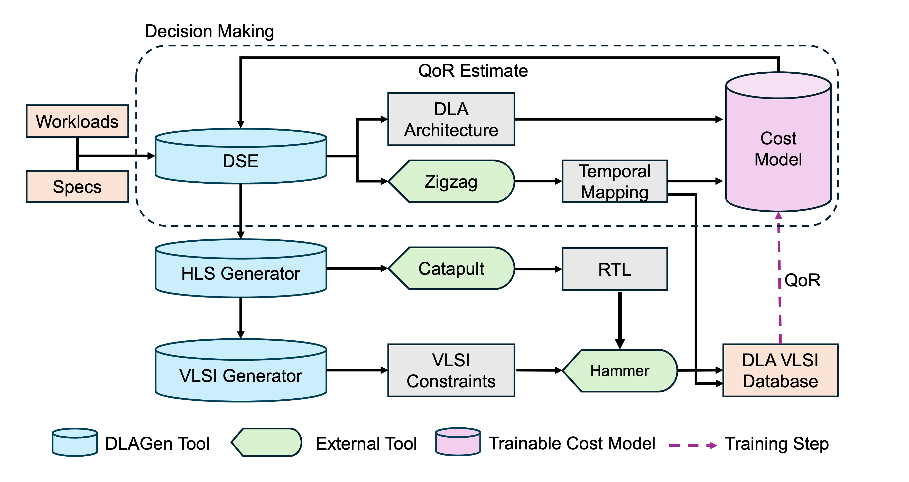

*DLAGen is under active development. This is an initial release (v0.5) with incomplete features and testing. We expect to release v1.0 in August 2025. Please watch and star our repo to stay in tune for updates!*
# DLAGen 

**DLAGen** is a hardware generator framework that outputs the **block-level VLSI database for a deep learning ASIC accelerator** with an architecture optimized for user specified models. It automatically searches for the most efficient hardware configuration with design space exploration and compiles down to VLSI-level, relying on high-level synthesis, and loop-based hardware abstractions.

## Requirements

### Commercial Tools Required

- [Siemens Catapult HLS 2024.2](https://eda.sw.siemens.com/en-US/ic/catapult-high-level-synthesis/)
- [Cadence Digital Design and Implementation tools](https://www.cadence.com/en_US/home/tools/digital-design-and-signoff.html)

### Open-Source Tools

- [Zigzag](https://github.com/KULeuven-MICAS/zigzag)
- [Hammer](https://github.com/ucb-bar/hammer)

We thank the authors of these tools for open-sourcing their amazing projects!

## Installation

We recommend using [Anaconda](https://www.anaconda.com/docs/getting-started/anaconda/install) (optional) for Python environment management. 

    git clone https://github.com/CMU-VLSI/dlagen.git
    conda create -n dlagen python=3.12
    # install zigzag and other requirements
    pip install -r requirements.txt
    # install hammer with pip editable install (recommended)
    git clone https://github.com/ucb-bar/hammer.git
    cd hammer
	pip install -e .
	cd ..

## Quick Start

DLAGen is configured by an input `.yaml` file. An example configuration is provided in `configs/example.yaml`.

### Setup tool paths and licenses

DLAGen uses commercial HLS tool Catapult for RTL generation and EDA tools from Cadence (Genus/Innovus/Joules) for VLSI implementation. Path to the binary of these tools as well as scripts to set up their licenses must be provided to run DLAGen end-to-end.

**Catapult**: in `configs/example.yaml`, provide your Catapult binary path in `[hls][catapult][binary]`, an shell script to setup Catapult license in `[hls][catapult][env]`
**EDA**: EDA tools are launched from Hammer. Edit `inputs/hammer/hammer-env.yml` to specify the binary path for Cadence Genus, Innovus as well as tool versions and licenses.

### Technology and SRAM Macros

Semiconductor process node is added as a technology plugin in *Hammer*. Please follow their [documentation](https://hammer-vlsi.readthedocs.io/en/stable/Technology/index.html) to set up. The open-source PDKs can also be used with Hammer. 

SRAMs are a fundamental part of deep learning ASICs. DLAGen can automatically map memories to SRAM macros and invoke SRAM compilers. To add a SRAM compiler, in `configs/example.yaml`, under `[vlsi][sram][library]`, provide the compiler launch script. In addition, the path to Verilog, SPICE, LEF, LIB, GDS files associated with the compiled macro is specified in a Python f-string format. A mapping of the RTL ports to the macro ports are also required. Then, under `[vlsi][sram][macro]`, specify the supported width, depth and column muxing configurations of the memory compiler. 

Currently, only single-port SRAMs are supported. We will support 1R1W and dual-port SRAMs in release v1.0.

### To run the example,

`python main.py synthesize --config configs/example.yaml`

## Creating Your Own Runs

### Specify Target Workload

An example workload specification for ResNet-18 is provided under `workloads/resnet18.yaml`. This format is used by Zigzag. This is a more simplistic format than popular frameworks like ONNX. We may support converting models in existing frameworks to this format in the future.

### Specify Hardware Constraints and Design Space

The area and throughput constraints of the target application can be provided under `[dse][constraints]`. The multi-stage genetic algorithm (GA) used in the design space exploration engine can be configured by its population size and generation limit, which affects the search time and quality of final solution. GA is run in parallel by default, which is configurable with `[dse][num_core]`.

A list of possible choices for the spatial sizes of the MAC array and sizes of the buffers are also specified under `[dse][*_choices]` to constrain the design space.

### Quantization (to be released!)

DLAGen can enable research on different quantization formats and methods with automatic exploration of hardware design space when a new quantization scheme is introduced

### Cost Model Training (to be released!)

DLAGen can use generated designs' quality-of-results to update its cost model for a more accurate cost estimation.

## What’s Next  

- **Open-Source HLS and EDA tools**: using XLS for C2RTL conversion, and OpenRoad for VLSI
- **Layer-Fused Dataflow**: fuse layers to save off-chip bandwidth of intermediate activations and improve utilization
- **New Quantization and Sparsity Methods**: block floating-point formats, look-up-table-based, unstructured and structured sparsity

## Feature Requests

We welcome requests for new features! Feel free to fork the repository, submit pull requests, or open issues. 
